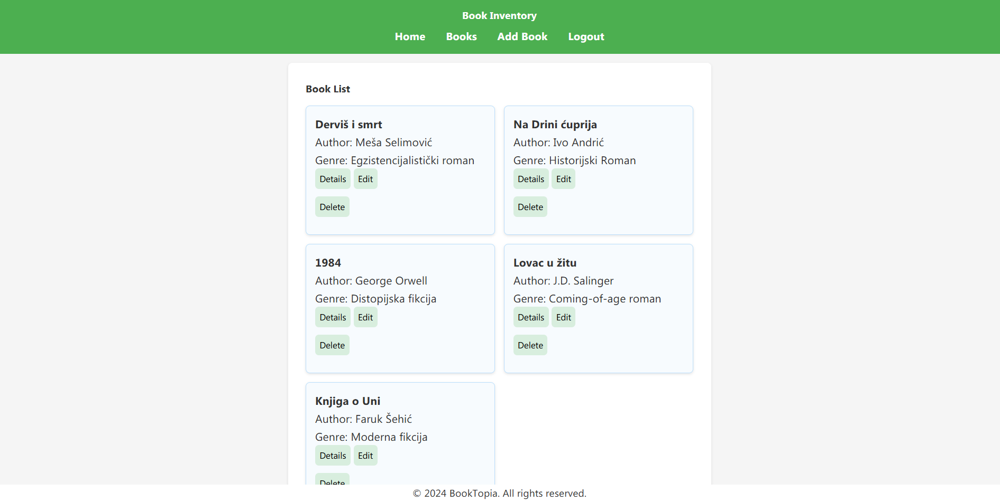

<div id="top"></div>

<!-- PROJECT LOGO -->
<br />
<div align="center">
  <a href="#">
    
  </a>

  <h1 align="center">BookVentor</h1>

  <p align="center">
    A PHP-based application for managing book inventory effectively.
    <br />
  </p>
</div>

<!-- TABLE OF CONTENTS -->
<details>
  <summary>Table of Contents</summary>
  <ol>
    <li>
      <a href="#about-the-project">About The Project</a>
      <ul>
        <li><a href="#features">Features</a></li>
        <li><a href="#built-with">Built With</a></li>
        <li><a href="#tree-structure">Tree Structure</a></li>
      </ul>
    </li>
  </ol>
</details>

<!-- ABOUT THE PROJECT -->
## About The Project

<strong>BookVentor</strong> is a PHP-based web application that leverages MySQL to manage book inventory. It provides a seamless experience for organizing, tracking, and accessing book records with a user-friendly interface.

### Features

- Add, edit, and delete book entries
- View a list of all books with detailed information for the user
- Intuitive navigation and clean UI design
- Built with modular components for scalability
- User login and registration



### Built With

- PHP
- MySQL
- HTML5 & CSS3
- Sass

<p align="right">(<a href="#top">back to top</a>)</p>

### Tree Structure

```sh
BookVentor
├───assets
│   └───img
│       └───logo.png
│
├───Framework
│   ├───Controllers
│   │       ├───ActionsController.php
│   │       ├───AuthController.php
│   │       ├───HomeController.php
│   │       └───ListController.php
│   ├───Model
│   │       └───Database.php
│   ├───Router
│   │       ├───Router.php
│   │       └───routes.php
│
├───Views
│   ├───bookList.view.php
│   ├───bookView.view.php
│   ├───createBook.view.php
│   ├───error.view.php
│   ├───home.view.php
│   ├───login.view.php
│   └───register.view.php
│
├───helpers
│   ├───partials
│   │       ├───errorMessage.php
│   │       ├───footer.php
│   │       ├───head.php
│   │       ├───navbar.php
│   │       └───welcomeMessage.php
│   ├───config.php
│   └───helpers.php
│
├───public
│   └───styles
│       ├───colors.scss
│       ├───main.scss
│       └───reset.scss
│
└───vendor
    ├───.htaccess
    ├───composer.json
    ├───composer.lock
    └───index.php

```

<p align="right">(<a href="#top">back to top</a>)</p>
